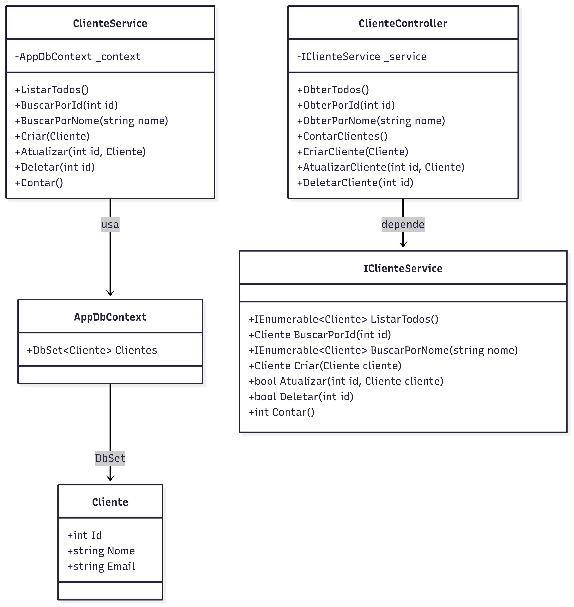
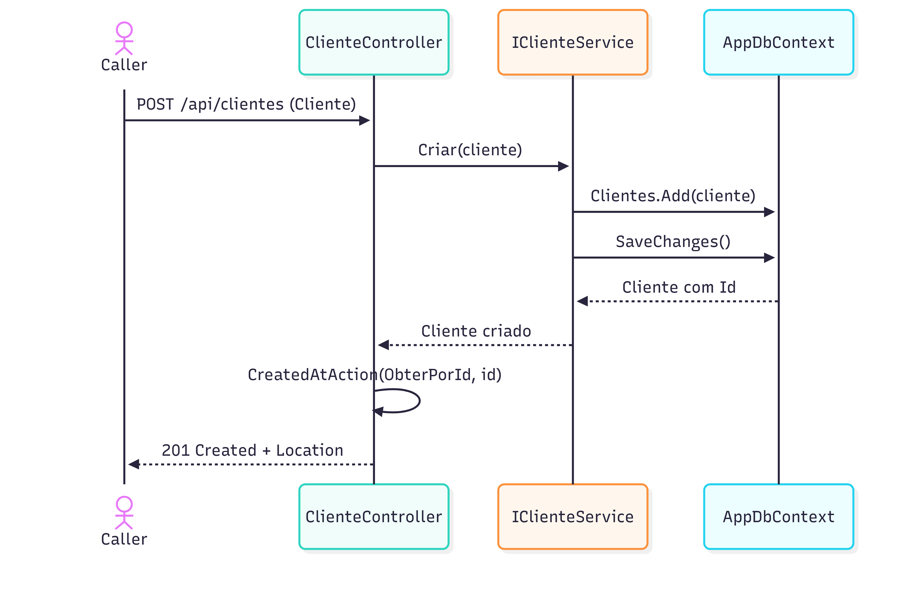

# DesafioFinalClienteApi
Desafio do bootcamp da pós em arquitetura de sofwtare.

## Objetivo
Disponibilizar publicamente dados de Clientes via API REST para parceiros, permitindo operações CRUD e consultas agregadas (contagem, busca por nome), seguindo o MVC.

## Requisitos Funcionais
1. Criar cliente ( POST /api/clientes ).
2. Listar todos os clientes ( GET /api/clientes ).
3. Buscar por ID ( GET /api/clientes/{id} ).
4. Buscar por nome (contém) ( GET /api/clientes/nome/{nome} ).
5. Atualizar cliente ( PUT /api/clientes/{id} ).
6. Excluir cliente ( DELETE /api/clientes/{id} ).
7. Contar clientes ( GET /api/clientes/contar ).

## Decisões Arquiteturais
- MVC: Controller expõe endpoints, delega regra de negócio ao Service; Model representa aentidade; Data (DbContext) provê acesso a dados.
- EF Core InMemory: simula persistência, sem custos de infraestrutura.
- DI: serviços registrados via container padrão do ASP.NET Core.
- Swagger: padrão de documentação para navegação e testes manuais.

## Estrutura de pastas
```
  Controllers/ - Camada de apresentação HTTP (REST). Recebe requisições, valida entrada básica e orquestra chamadas ao Service.
  Data/ - Contexto de dados (EF Core). Centraliza DbContext e DbSets.
  Models/ - Entidades de domínio (Cliente), com anotações de validação.
  Services/ - Regras de negócio e orquestração de acesso a dados (via DbContext).
  Program.cs - Configuração de DI, EF InMemory e Swagger.
```
## Diagrama de Classes


## Diagrama de sequência(Criar cliente)


## Explicação da estrutura e do código
1. Models
- Contém as entidades de domínio.
- Cada entidade representa uma tabela ou recurso da aplicação.
- Inclui anotações de validação ([Required], [MaxLength], [EmailAddress]) que ajudam a garantir consistência dos dados.
- Para este projeto o arquivo principal é Cliente.cs.

2. Data
- Contém o AppDbContext, que herda de DbContext do EF Core.
- Define o DbSet<Cliente>, que simula uma tabela em memória.
- Centraliza a persistência e permite trocar o provedor (ex.: de InMemory para SQL Server ou outro banco de dados) sem alterar o restante do código.

3. Services
- Camada de lógica de negócios.
- Expõe uma interface (IClienteService) e sua implementação (ClienteService).
- Isola o acesso ao banco do controller, aplicando boas práticas de separação de responsabilidades.
- Implementar a lógica do CRUD e das funcionalidades estendidas (contar, listar todos).
  
4. Controllers
- Exposição dos endpoints REST.
- ClienteController recebe as requisições HTTP e chama os métodos do service.
- Aplica validações básicas (ex.: verificar ModelState).
- Retorna os resultados no formato adequado (200 OK, 201 Created, 404 Not Found, 400 Bad Request).
- Usa CreatedAtAction para retornar 201 Created com Location do recurso criado.

5. Program.cs
- Ponto de entrada da aplicação.
- Configura o Dependency Injection (DI) ou injeção de dependência(ID) para ligar o IClienteService ao ClienteService.
- Configura o EF Core InMemory.
- Ativa o Swagger para documentação interativa.
- Define o pipeline da aplicação (UseSwagger, UseHttpsRedirection, MapControllers).
